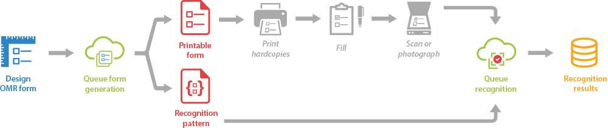

Aspose.OMR Cloud supports end-to-end OMR process - from designing a form to recognizing its filled hardcopies. The workflow includes the following stages:

All resource-consuming tasks (generation and recognition of OMR forms) are done in the cloud, freeing up resources on the end user's device. All cloud tasks are queued, which prevents multiple simultaneous requests from interfering with each other and consuming too much processor time.

Aspose.OMR Cloud SDKs implement wrapper classes that allow you to interact with the Aspose.OMR Cloud REST API without writing low-level HTTP requests and parsing responses.

{} 
Aspose.OMR for .NET is a software OMR solution that works without special hardware or accessories. Therefore, printing, filling out, and scanning forms are not covered in this reference.
{}
