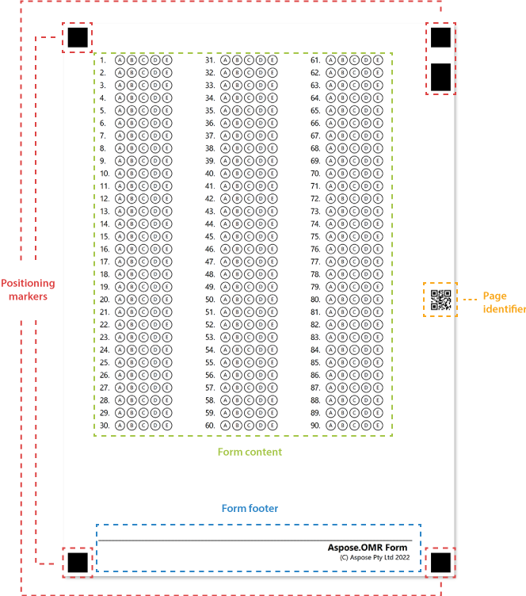

Most OMR-ready forms have a unified structure that allows the recognition engine to reliably associate handwritten marks with answers. Aspose.OMR Cloud uses a special page layout to provide superior recognition accuracy of multi-page forms, photos, and even rotated / skewed images.

## Positioning markers

Located at the corners of the page, these 5 boxes allow a recognition engine to quickly find inner elements of the form, and determine its size and orientation. Positioning markers are crucial for processing skewed scans and photos.

{} 

Never remove these markers from the OMR form and do not change their size or position in a graphics editor!

{} 

## Form content

Main area of the form containing response bubbles along with texts, images, and other elements.

## Form footer

An area at the bottom of the page that is primarily used for placing form title, branding information and barcodes.

Footers are manually added to the form's source code and may not be present.

## Page identifier

This small QR code only appears on multi-page forms. It contains an encoded identifier of the form and the page number, allowing the recognition engine to treat multiple scanned images as one form.
